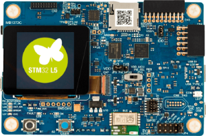
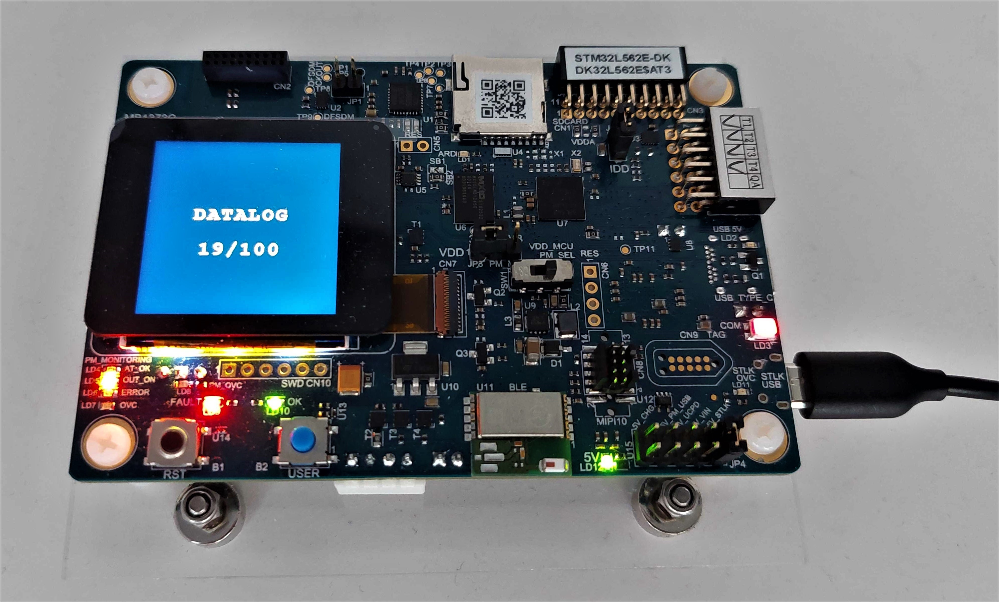
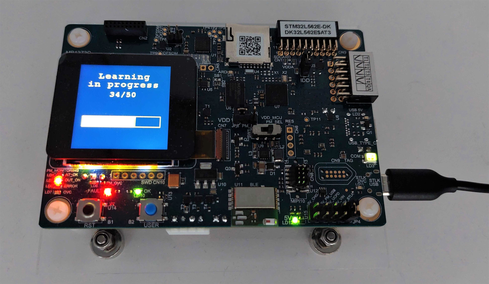
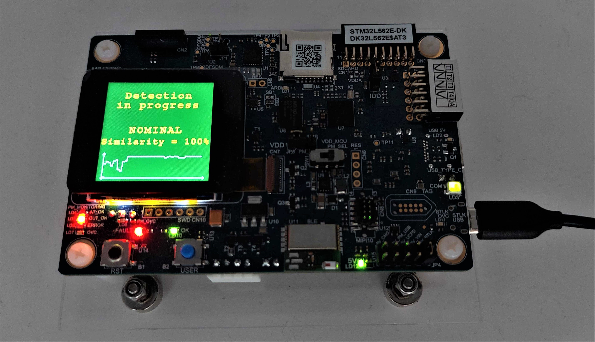

# STM32 Application for vibration monitoring with NanoEdge AI Studio



- [STM32 Application for vibration monitoring with NanoEdge AI Studio](#stm32-application-for-deep-learning-framework-with-tvm)
    - [Motivation](#motivation)
    - [Prerequisites](#prerequisites)
    - [STM32 Application Development Flow](#stm32-application-development-flow)
      - [Code settings](#code-settings)
      - [NanoEdge AI library integration](#nanoedge-ai-library-integration)
    - [Flashing and running the application on the board](#flashing-and-running-the-application-on-the-board)


## Motivation

This example code allows to perform a vibration monitoring system with a STM32L562E-DK (STM32 discovery kit), using a maching learning library generated by NanoEdge AI Studio.
The library integrates a pre-trained AI model which has to be trained in the MCU (corresponding to the learning phase), before switching to the detection phase.
Each NanoEdge AI library is generated from input data logged during periods of nominal and abnormal behavior of the system to monitor. To create a new library fitting your application, you need to follow the NanoEdge AI developement flow and integrate the new library in the code by replacing the existing one.

All documentation about NanoEdge AI Studio can be found [here](https://wiki.st.com/stm32mcu/wiki/Category:NanoEdgeAI).


## Prerequisites

This STM32Cube project has been developped and tested under STM32CubeIDE v1.8.0.
It requires installing following softwares and packages:

 - The STM32CubeIDE software:
   [Download](https://www.st.com/en/development-tools/stm32cubeide.html#get-software)

 - The STM32 board support package (BSP) and the STM32 hardware abstraction layer (HAL) library for L5 series:
    [ZIP file](https://www.st.com/en/embedded-software/stm32cubel5.html#get-software)
    [GitHub](https://github.com/STMicroelectronics/STM32CubeL5)

 - The STM32CubeProgrammer software:
   [Download](https://www.st.com/en/development-tools/stm32cubeprog.html#get-software)

To create your own NanoEdge AI project, following softwares are also required:
 - The NanoEdge AI Studio software:
   [Download](https://www.st.com/en/development-tools/nanoedgeaistudio.html#get-software)

 - A serial port terminal, for example PuTTY:
   [Download](https://www.chiark.greenend.org.uk/~sgtatham/putty/latest.html)


## STM32 Application Development Flow

### Code settings
This project proposes 2 different operating modes:
 - The datalogging mode, in which data output by the accelerometer are streamed thought serial port,

 - The NanoEdge AI mode, in which the machine learning library will be trained and then will perform inferences to output a similarity indicator between the current behavior of the system and the behavior matching the reference model.



The selection of the mode is done by a directive in the main program (path being ``Core/Src/main.c``):
```
#define DATALOG 1       // 0: program in NanoEdge AI mode | 1: program in datalogging mode
``` 

The user is free to edit 3 other directives: the accelerometer data rate, the number of learning interations done before switching to detection, and the NanoEdge AI threshold (which delimits nominal and abnormal regimes in detection phase):
```
#define ACC_DATA_RATE   833   // 833, 1667 or 3333 Hz
#define LEARNING_ITERATIONS 100   // When DATALOG 1: number of signals logged
#define NEAI_THRESHOLD    90    // Between 1 and 99, typically around 90
```

### NanoEdge AI library integration
The NanoEdge AI library is composed of 2 files to include in the STM32Cube project:
 - The ```libneai.a``` file, to place in the ``Core/lib`` folder,
 - The ```NanoEdgeAI.h``` file, to place in the ``Core/Inc`` folder.

To add the library to the compilation string, it is necessary to edit project settings, by going in ``Project -> Properties -> C/C++ Build -> Settings -> Tool Settings -> MCU GCC Linker -> Libraries``.
Here, it is required to add ``neai`` in the "Libraries" section, and ``../Core/lib`` in the "Library search path" section.


### Running and flashing the application on the board

Connect your STM32L562E-DK (by the STLK USB port) to your computer.
Compile the code using STM32CubeIDE.
Flash your application using STM32CubeProgrammer.


